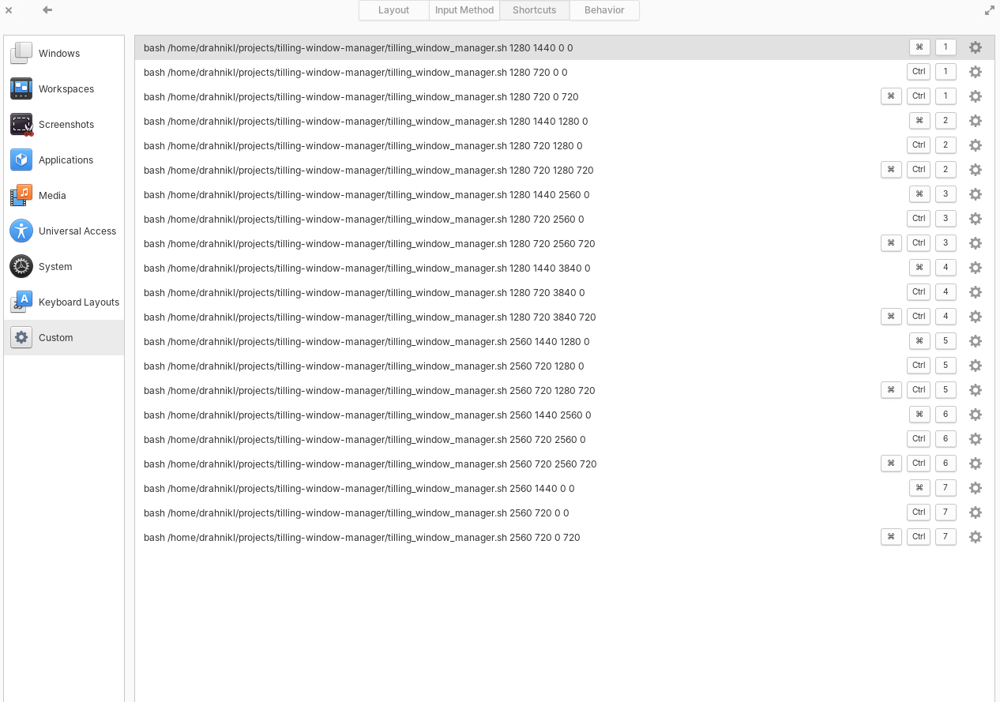
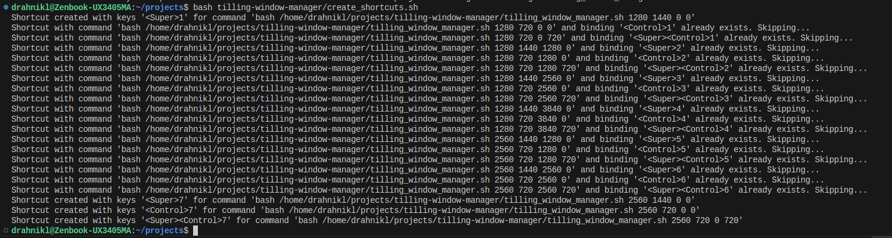

# Tilling Window Manager

Script works like a simple tilling window manager. Script uses `xdotool`, `wmctrl` and `xprop` (`x11-utils`). Shortcuts pointing to the script `tilling_window_manager.sh` have to be added manually or via `gsettings` is option run prepared script `bash create_shortcuts.sh <directory with tilling_window_manager.sh, as default is taken current working directory>` (previously added shortcuts are not rewritten or thrown away and is not created any duplicated shortcut when is the script run multiple times but shortcuts have to be free to associate).

```
$ sudo apt-get install wmctrl xdotool x11-utils

# Super+[1-7], Super+Control+[1-7], Control+[1-7] have to be free to associate (is necessary to manually cancel existing associations)

$ bash create_shortcuts.sh
```



